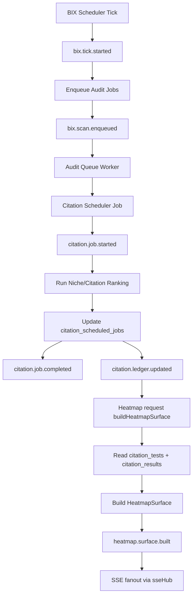

# Event Backbone: BIX + Citation + Heatmap

This map defines the shared coordination layer between BIX scheduling, citation execution, and heatmap derivation.

## Single backbone contract

- Event transport: `server/src/services/eventBackbone.ts`
- Policy source: `server/src/config/runtime.system.config.ts`
- SSE fanout: `server/src/services/sseHub.ts`

## Event names and ownership

- `bix.tick.started` (scheduler)
- `bix.scan.enqueued` (scheduler)
- `bix.error` (scheduler)
- `citation.job.started` (citation scheduler)
- `citation.job.completed` (citation scheduler)
- `citation.job.failed` (citation scheduler)
- `citation.ledger.updated` (citation scheduler)
- `heatmap.surface.built` (heatmap builder)

## Exact execution graph

## Why this is a shared backbone

- BIX does not write UI directly. It emits domain events.
- Citation job completion emits ledger update events.
- Heatmap is a pure projection from citation tables and emits build events.
- SSE is fed by backbone events, not by ad-hoc route booleans.

## Policy controls now centralized

`runtime.system.config.ts` controls:

- BIX concurrency + enable switch
- Feature flags
- Citation policy requirements
- Scheduler tier cadence and jitter
- AI strict timeout and token budgets
- SSE streaming enablement

## Non-goals

- No scoring outside ledger-backed paths
- No heatmap heuristic writes
- No tier logic in route-local booleans

